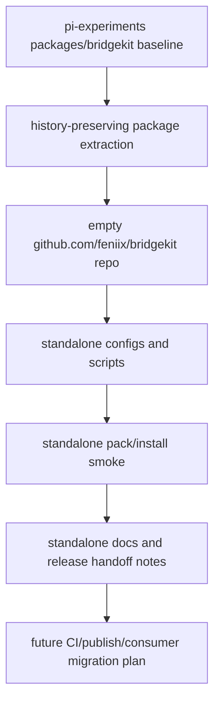
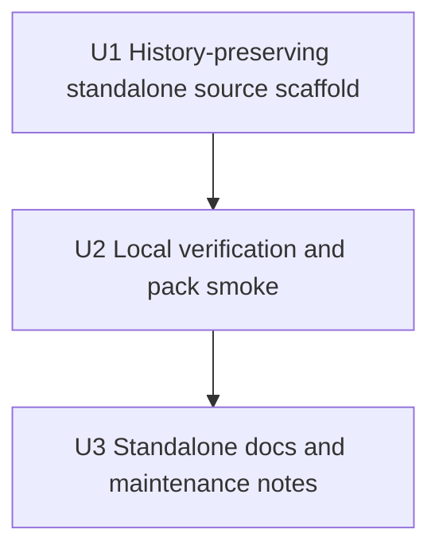

# refactor: Graduate BridgeKit to a standalone project

## Summary

Graduate `@feniix/bridgekit` from the `pi-experiments` incubator by copying/extracting BridgeKit into the already-created standalone repository at `https://github.com/feniix/bridgekit.git`, preserving package history, and making the new repo build, test, typecheck, pack, and smoke-test itself independently. This plan does **not** remove BridgeKit from `pi-experiments`, modify fixture packages, add CI, or publish to npm.

**Target repo for implementation:** `bridgekit` (new standalone project; already created and currently empty). `pi-experiments` remains unchanged during this phase and serves only as the source/baseline for extraction.

---

## Problem Frame

`pi-experiments` is an incubator for packages, MCP integrations, and agent-accessible tool experiments. BridgeKit is ready to leave the incubator as its own project because it has a small public API, package docs, and fixture/example packages that were created to validate its design. The immediate graduation step is repository independence: copy BridgeKit to its own repo without removing or rewiring the incubator copy.

---

## Requirements

* R1. Preserve the current `@feniix/bridgekit` package contract while updating the runtime floor to pi's supported minimum: ESM-only, Node `>=22.19.0`, TypeBox-backed core, root/`./pi`/`./mcp`/`./package.json` exports, no supported deep imports, and no `registerMcpTools` helper.

* R2. Populate `https://github.com/feniix/bridgekit.git` with BridgeKit source/docs while preserving relevant git history across both `packages/bridgekit` and the pre-rename `packages/pi-portable-tools` path.

* R3. Make the standalone repo self-contained: package metadata, lockfile, TypeScript config, Biome config, local scripts, tests, and package verification must not depend on `pi-experiments` paths.

* R4. Add standalone package-smoke coverage that installs BridgeKit from a packed tarball and proves runtime exports, TypeScript NodeNext declaration resolution, expected file contents, package metadata, and unsupported deep-import failure.

* R5. Document maintenance and release handoff expectations without implementing publish automation yet: repository URL, ownership placeholders, pre-1.0 compatibility stance, future trusted-publishing setup, and first-release gates.

* R6. Leave `pi-experiments` unchanged in this phase: do not rewire `pi-text-utils` or `pi-sequential-thinking`, do not remove `packages/bridgekit`, and do not remove current vendoring/package-smoke scaffolding.

---

## Scope Boundaries

* Do not modify `pi-experiments` code, package manifests, fixture package scripts, TypeScript project references, or README breadcrumbs in this phase.

* Do not remove, archive, or stop building `packages/bridgekit` from `pi-experiments` in this phase.

* Do not transition `pi-text-utils` or `pi-sequential-thinking` to use BridgeKit from the new repo in this phase. Existing fixture smoke scripts may be read as examples only; do not edit, reconfigure, or rewire fixture packages as part of this implementation.

* Do not publish BridgeKit to npm in this work.

* Do not add GitHub Actions CI or trusted-publishing workflows in this work; document them as the next operational step. Do not create `.github/workflows/*`, GitHub environment settings, npm trusted-publisher configuration, release automation, tags, releases, or automation credentials in this phase.

* Do not change BridgeKit's API or runtime semantics beyond the Node engine floor update to `>=22.19.0` during this extraction phase.

* Do not split BridgeKit into separate core/pi/MCP npm packages; this is outside the foreseeable scope.

* Do not perform the MCP SDK v2 migration in this plan. Defer that migration until MCP SDK v2 is no longer alpha/stabilizes enough to be treated as a production dependency.

* Do not rely on `workspace:` or `file:` dependency ranges in publishable package manifests.

* Implementation must not edit, stage, commit, tag, or push from the `pi-experiments` working checkout. All history rewriting happens only in a fresh disposable clone; the source checkout is used for read-only inspection plus before/after `git status --short` checks.

### Deferred to Follow-Up Work

* Add GitHub Actions CI for the standalone repo after the initial repo scaffold is working locally.

* Configure npm trusted publishing/provenance and publish a prerelease or stable version after CI exists.

* Rewire `pi-experiments` fixture packages to consume the released npm module in a later phase.

* Remove or archive `packages/bridgekit` from `pi-experiments` only in a later cleanup phase after fixture packages have been rewired.

* Cross-repo CI from BridgeKit PRs into `pi-experiments` is not planned for the foreseeable future. Manual fixture validation is enough until real external consumer pressure justifies automation.

---

## Context & Research

### Relevant Code and Patterns

* `packages/bridgekit/package.json` defines `@feniix/bridgekit` v0.2.0 with ESM, `main`, `types`, explicit exports, `files`, `sideEffects`, runtime dependencies, and scripts that currently call `../../scripts/*`.

* `packages/bridgekit/src/index.ts`, `packages/bridgekit/src/pi.ts`, and `packages/bridgekit/src/mcp.ts` define the public root/pi/MCP entrypoints to preserve.

* `packages/bridgekit/src/core/define-tool.ts` and `packages/bridgekit/src/core/execute-tool.ts` contain the host-neutral TypeBox-backed contract and validation helper.

* `packages/bridgekit/src/adapters/pi.ts`, `packages/bridgekit/src/adapters/mcp.ts`, and `packages/bridgekit/src/adapters/mcp-signal.ts` isolate host behavior from the core.

* `packages/bridgekit/README.md`, `packages/bridgekit/llms.txt`, and `packages/bridgekit/examples/README.md` are already package-level docs and should move with the package.

* `scripts/verify-bridgekit-dist.mjs` encodes package-output invariants: metadata, public dist files, docs inclusion, absent `registerMcpTools`, and no dangling source-map references.

* `scripts/run-built-tests.mjs` currently assumes `packages/*/dist`; the standalone repo needs a package-local test runner.

* `biome.json` currently includes monorepo globs such as `packages/*/src/**/*.ts`; the standalone repo needs root `src/**/*.ts` and `scripts/**/*.mjs` globs instead.

* `packages/pi-text-utils` and `packages/pi-sequential-thinking` are fixture/example packages created to validate BridgeKit. They remain untouched in this plan.

### Institutional Learnings

* `docs/plans/2026-05-16-002-extract-portable-tool-sdk-plan.md` established the small public surface: root/core, `/pi`, `/mcp`, and no unsupported high-level MCP helper.

* `docs/plans/2026-05-17-001-portable-tools-publish-polish-plan.md` established publish-contract expectations: ESM-only, `sideEffects: false`, no dangling source maps, extensible host typing, and explicit metadata.

* `docs/plans/2026-05-16-001-fix-text-utils-hardening-parity-plan.md` captured the packaging lesson that workspace tests hide install bugs; packed-install smokes are required.

* `docs/architecture/plan-dual-pi-mcp-tool-sdk-experiment.md` is the architecture source for host-neutral portable tools plus isolated host adapters.

### External References

* npm package metadata, lifecycle, `files`, semver, dist-tags, and trusted-publishing docs inform the future release notes but do not make publishing part of this plan.

* Node package docs support explicit `type` and `exports` as the public API boundary; `exports` encapsulates unlisted deep paths.

* TypeScript NodeNext docs support the current ESM package setup; committing a standalone lockfile keeps dependency resolution stable in the new repo.

* GitHub subdirectory extraction guidance supports history-preserving extraction with `git filter-repo` or equivalent tooling.

* Local git history shows BridgeKit was renamed from `packages/pi-portable-tools` to `packages/bridgekit` in commit `72d4701`; meaningful history preservation must follow both paths, including earlier commits such as `c2ffbab feat(portable-tools): add core sdk package`.

---

## Key Technical Decisions

* Use a history-preserving extraction path: populate the empty `https://github.com/feniix/bridgekit.git` repo from `packages/bridgekit` and its pre-rename `packages/pi-portable-tools` history rather than doing a history-free copy.

* Standalone repo root is the package root: move/extract `packages/bridgekit/*` to the root of `https://github.com/feniix/bridgekit.git`, not to a nested `packages/bridgekit` directory.

* Freeze the public API during graduation: package name, ESM-only module type, root/pi/MCP/package metadata exports, TypeBox-backed core, TypeScript NodeNext declarations, pi/MCP error semantics, and absence of `registerMcpTools` remain unchanged.

* Raise the package engine floor to `>=22.19.0` because pi's minimum supported Node version is 22.19.0. The standalone package should not advertise a lower runtime floor than the host ecosystem it is designed to serve.

* Do not gate extraction on MCP SDK v2. Preserve the current BridgeKit MCP SDK v1 baseline, record the source commit SHA, and defer any v2 migration until MCP SDK v2 is no longer alpha.

* Port only BridgeKit-owned infrastructure into the standalone repo: clean, test, verify, and smoke scripts should live under `bridgekit/scripts/` and must not reference `../../`, `packages/*`, or `pi-experiments` workspace paths.

* Generate a standalone `package-lock.json` from the new repo's finalized `package.json`; do not copy the current workspace lockfile as package-local truth.

* Add a BridgeKit self-smoke before any publish or consumer-rewire work: the standalone repo must prove its own tarball independently, instead of relying on `pi-experiments` fixture smokes.

* Keep `pi-experiments` unchanged as the transition baseline. The source-of-truth flip to standalone BridgeKit should happen in a later release/fixture-validation plan.

* Leave CI, trusted publishing, npm release, fixture consumer rewiring, and incubator cleanup as explicit follow-up work rather than hidden scope inside repository extraction.

---

## Open Questions

### Resolved During Planning

* New standalone project or in-repo polish only? New standalone BridgeKit repository/project at `https://github.com/feniix/bridgekit.git`; the repo already exists and is empty.

* Preserve git history? Yes. Use a history-preserving extraction path for `packages/bridgekit`.

* Are `pi-text-utils` and `pi-sequential-thinking` real downstream consumers? Treat them as fixture/example packages created to validate BridgeKit, not as independent real consumers.

* Should CI/release automation and consumer rewiring be in this plan? No. Defer both.

* Should adapter package splitting remain as future work? No. The plan should not propose adapter-package splitting for the foreseeable future.

* Should the repo split also migrate MCP SDK v2? No. MCP SDK v2 is still alpha, so extraction should proceed on the current SDK v1 baseline and defer v2 until it is no longer alpha.

### Deferred to Implementation

* Named maintainer or maintainer group for BridgeKit issue triage and release decisions.

* Exact first standalone release version, once publishing is planned.

* Whether to pin TypeScript more tightly if standalone declaration output changes unexpectedly.

---

## Output Structure

Expected standalone `bridgekit` repo shape:

```text
bridgekit/
  docs/
    extraction.md
    releasing.md
  examples/
    README.md
  scripts/
    clean-package-dist.mjs
    run-built-tests.mjs
    smoke-package.mjs
    verify-bridgekit-dist.mjs
  src/
    index.ts
    mcp.ts
    pi.ts
    adapters/
      mcp-signal.ts
      mcp.integration.test.ts
      mcp.test.ts
      mcp.ts
      mcp.typecheck.ts
      pi.test.ts
      pi.ts
    core/
      define-tool.ts
      execute-tool.test.ts
      execute-tool.ts
  biome.json
  llms.txt
  package-lock.json
  package.json
  README.md
  tsconfig.base.json
  tsconfig.json
```

This tree is a target shape, not a constraint. If implementation chooses shorter script names such as `scripts/verify-dist.mjs`, references in `package.json`, docs, and tests should use that name consistently.

---

## High-Level Technical Design

> *This illustrates the intended approach and is directional guidance for review, not implementation specification. The implementing agent should treat it as context, not code to reproduce.*



The active migration ends when the standalone repo can verify BridgeKit locally from its own history-preserved source and tarball. It deliberately stops before GitHub Actions, npm publishing, downstream consumer rewiring, and removal of the incubator copy.

---

## Alternative Approaches Considered

| Approach                                                    | Why not chosen as the default                                                                        |
| :---------------------------------------------------------- | :--------------------------------------------------------------------------------------------------- |
| Keep BridgeKit only in `pi-experiments`                     | Leaves the package dependent on incubator root scripts and weakens the graduation boundary.          |
| Do a history-free copy into the new repo                    | The user explicitly wants to preserve git history.                                                   |
| Include CI, publish, and consumer rewiring in the same plan | Too much operational scope for the first extraction pass; the user explicitly deferred those pieces. |
| Delete `packages/bridgekit` immediately                     | The user explicitly wants to copy/extract without removing BridgeKit from `pi-experiments`.          |
| Split core/pi/MCP into separate packages                    | Not wanted for the foreseeable future and unsupported by current consumer pressure.                  |
| Migrate MCP SDK v2 now                                      | MCP SDK v2 is still alpha; keep extraction on the current SDK v1 baseline and defer v2 until stable. |

---

## Implementation Units



### U1. History-preserving standalone source scaffold

**Goal:** Populate the empty `bridgekit` repo with BridgeKit source, docs, package metadata, TypeScript config, Biome config, and lockfile generation path while preserving `packages/bridgekit` history.

**Requirements:** R1, R2, R3

**Dependencies:** A clean, current `packages/bridgekit` source baseline in `pi-experiments`; no MCP SDK v2 migration is required for extraction.

**Files:**

* Create in `bridgekit`: `package.json`

* Create in `bridgekit`: `package-lock.json`

* Create in `bridgekit`: `tsconfig.json`

* Create in `bridgekit`: `tsconfig.base.json`

* Create in `bridgekit`: `biome.json`

* Create in `bridgekit`: `README.md`

* Create in `bridgekit`: `llms.txt`

* Create in `bridgekit`: `examples/README.md`

* Create in `bridgekit`: `src/index.ts`

* Create in `bridgekit`: `src/pi.ts`

* Create in `bridgekit`: `src/mcp.ts`

* Create in `bridgekit`: `src/core/define-tool.ts`

* Create in `bridgekit`: `src/core/execute-tool.ts`

* Create in `bridgekit`: `src/core/execute-tool.test.ts`

* Create in `bridgekit`: `src/adapters/pi.ts`

* Create in `bridgekit`: `src/adapters/pi.test.ts`

* Create in `bridgekit`: `src/adapters/mcp.ts`

* Create in `bridgekit`: `src/adapters/mcp-signal.ts`

* Create in `bridgekit`: `src/adapters/mcp.test.ts`

* Create in `bridgekit`: `src/adapters/mcp.integration.test.ts`

* Create in `bridgekit`: `src/adapters/mcp.typecheck.ts`

* Create in `bridgekit`: `docs/extraction.md`

* Create in `bridgekit`: `LICENSE` *(if the standalone repo needs a license file matching package metadata)*

**Approach:**

* Start from a fresh disposable clone, not the user's working `pi-experiments` checkout and not a linked git worktree. Do not run history-rewriting tools in the source checkout or a linked worktree.

* Run a source preflight before extraction: record the exact source commit SHA, confirm the current BridgeKit dependency/lockfile baseline, confirm `@modelcontextprotocol/sdk` remains on major version 1, and confirm the source repo has no unexpected working-tree changes. Extract from a detached checkout at that recorded SHA in the fresh disposable clone so later `pi-experiments` commits cannot drift into the standalone baseline.

* Verify the target remote is truly empty before any push using `git ls-remote --heads --tags https://github.com/feniix/bridgekit.git`. Expected output is no refs. If any branch or tag exists, keep extraction local and stop for an explicit push strategy; do not merge unrelated histories or force-push by default. After filtering and verification, confirm no remaining `origin` remote points at `pi-experiments`, add the target as `bridgekit-target`, push explicitly with `git push bridgekit-target HEAD:refs/heads/main`, and verify remote `main` points to local `HEAD`. Do not use `--force` unless a separate explicit strategy is approved.

* Preserve history across both `packages/bridgekit` and the pre-rename `packages/pi-portable-tools` path so prior portable-tool commits remain visible in the standalone repo. Use a disposable clone and `git filter-repo` or equivalent with both paths (`packages/pi-portable-tools/` and `packages/bridgekit/`) rewritten to the repo root. The intended procedure is:

```sh
SRC_SHA="$(git -C /path/to/pi-experiments rev-parse HEAD)"
git clone --no-local /path/to/pi-experiments /tmp/bridgekit-extract
cd /tmp/bridgekit-extract
git checkout --detach "$SRC_SHA"
git filter-repo --force \
  --path packages/pi-portable-tools/ \
  --path packages/bridgekit/ \
  --path-rename packages/pi-portable-tools/: \
  --path-rename packages/bridgekit/:
```

If `git filter-repo` or an equivalent history-rewrite tool is unavailable, stop and install/choose one rather than falling back to a history-free copy. After filtering, verify `package.json`, `src/`, `README.md`, `examples/`, and `llms.txt` exist at repo root and no `packages/` directory remains.

* Move package-local files to the standalone repo root and strip the historical package path prefixes from internal references. Verify root files exist directly at repo root (`src/`, `README.md`, `package.json`, `examples/`, `llms.txt`) rather than nested under `packages/*`.

* Preserve public entrypoint files and adapter/core boundaries exactly; do not change MCP adapter dependency strategy during extraction.

* Set `engines.node` to `>=22.19.0` and update docs that mention the runtime floor.

* Add standalone dev tooling to `package.json`: `typescript`, `@types/node`, `@biomejs/biome`, lint, typecheck, build, test, prepack, pack dry-run, and package-smoke scripts. Keep runtime dependencies limited to BridgeKit runtime needs (`@modelcontextprotocol/sdk` v1 and `typebox`). Allowed scripts are local verification only: `clean`, `lint`, `lint:fix`, `check`, `typecheck`, `build`, `test`, `verify:dist`, `pack:dry-run`, `package-smoke`, and `prepack`. Do not add `release`, `publish`, `semantic-release`, provenance, changelog-generation, or registry-publishing scripts.

* Rewrite `biome.json` around standalone paths: `src/**/*.ts`, `scripts/**/*.mjs`, `package.json`, `tsconfig.json`, `tsconfig.base.json`, and `biome.json`.

* Generate the standalone `package-lock.json` from the new repo after `package.json` is finalized.

* Add standalone package metadata for `repository`, `bugs`, and `homepage` using `https://github.com/feniix/bridgekit.git`.

* Verify history before any push to the standalone default branch: sample known commits from both `packages/pi-portable-tools` and `packages/bridgekit` history should be traceable with subject/author/date/content intact, including commits corresponding to original source SHAs `c2ffbab` and `72d4701`. Exact commit hashes are expected to change during path rewriting. If the rename commit becomes empty and is pruned because old/new paths collapse to the same root, record that in `docs/extraction.md`. Implementation may remain local or on a non-release branch until validation passes; do not create tags or releases.

* Do not modify `pi-experiments` in this unit; record `git status --short` for `pi-experiments` before and after extraction with expected empty output.

**Execution note:** Characterization-first. Capture current public exports from the incubator package before extraction, then prove the standalone repo exposes the same runtime API and declarations after the move.

**Patterns to follow:**

* `packages/bridgekit/package.json`

* `packages/bridgekit/tsconfig.json`

* `tsconfig.base.json`

* `biome.json`

* `packages/bridgekit/README.md`

* `packages/bridgekit/llms.txt`

* `packages/bridgekit/examples/README.md`

**Test scenarios:**

* Happy path: importing root, pi, and MCP subpaths from the standalone build exposes the same runtime symbols as the source incubator package.

* Type path: TypeScript NodeNext resolves declarations for root, pi, and MCP subpaths without monorepo `paths` or project references.

* Metadata path: `package.json` advertises Node `>=22.19.0`, repository/homepage/bugs metadata for `https://github.com/feniix/bridgekit.git`, and the intended public export map.

* History path: the standalone repo retains meaningful `packages/pi-portable-tools` and `packages/bridgekit` commit history rather than starting from a single squashed copy commit.

* History path: commits corresponding to original source SHAs `c2ffbab feat(portable-tools): add core sdk package` and `72d4701 chore: rename portable tool SDK to BridgeKit` are traceable by subject/author/date/content in extracted history; exact rewritten hashes may differ, and an empty/pruned rename commit is documented if applicable.

* Source safety path: source commit SHA and current dependency baseline are recorded in `docs/extraction.md`, extraction runs from that recorded SHA, and `pi-experiments` has no unexpected working-tree changes before or after extraction.

* Remote safety path: target remote preflight shows no heads or tags before any push; if refs exist, extraction remains local until a push strategy is explicitly chosen.

* Edge case: unsupported deep imports from `src/` or `dist/` are not documented or required by standalone examples.

* Error path: the MCP public subpath still does not expose `registerMcpTools`.

**Verification:**

* The standalone repo can install dependencies from its own `package-lock.json` and compile BridgeKit without reading `pi-experiments`.

* The standalone `package-lock.json` preserves the current MCP SDK v1 baseline: resolved `@modelcontextprotocol/sdk` major version is `1` (prefer exactly the current lock resolution unless an intentional non-v2 lock refresh is documented), and no MCP SDK v2 alpha/beta/canary package is introduced.

* Public API snapshots match the source package contract except for the intentional Node engine floor update if that update was not already present.

* History checks demonstrate pre-rename portable-tool commits survived extraction by subject/author/date/content, with original source SHAs recorded in `docs/extraction.md` rather than expected to remain identical after path rewriting.

* `pi-experiments` remains unchanged by this unit.

---

### U2. Localize build, test, verify, and package-smoke infrastructure

**Goal:** Give the standalone `bridgekit` repo self-contained scripts that prove build output, tarball contents, runtime imports, declaration usability, and package metadata.

**Requirements:** R3, R4, R1

**Dependencies:** U1

**Files:**

* Create in `bridgekit`: `scripts/clean-package-dist.mjs`

* Create in `bridgekit`: `scripts/run-built-tests.mjs`

* Create in `bridgekit`: `scripts/verify-bridgekit-dist.mjs`

* Create in `bridgekit`: `scripts/smoke-package.mjs`

* Modify in `bridgekit`: `package.json`

* Modify in `bridgekit`: `tsconfig.json`

* Modify in `bridgekit`: `README.md`

**Approach:**

* Use this standalone script contract in `package.json`:

```json
{
  "scripts": {
    "lint": "biome check .",
    "lint:fix": "biome check --write .",
    "check": "npm run lint && npm run typecheck",
    "clean": "node scripts/clean-package-dist.mjs",
    "typecheck": "tsc -b tsconfig.json --pretty false",
    "build": "npm run clean && tsc -b tsconfig.json",
    "test": "npm run build && node scripts/run-built-tests.mjs",
    "verify:dist": "node scripts/verify-bridgekit-dist.mjs",
    "pack:dry-run": "npm pack --dry-run --json",
    "package-smoke": "node scripts/smoke-package.mjs",
    "prepack": "npm run build && npm run verify:dist"
  }
}
```

* Rewrite script root discovery for the standalone repo and remove assumptions about `packages/*`, `../../scripts`, or `pi-experiments`.

* Rewrite `scripts/run-built-tests.mjs` to recursively collect `*.test.js` under `<repoRoot>/dist/src`, not `packages/*/dist`. It must fail if no tests are found with a standalone error such as `No built test files found under dist/src. Run npm run build first.`

* Keep `prepack` as the package-output gate: build from clean `dist`, verify metadata/public entrypoints/docs/source-map behavior, and fail if unsupported symbols reappear.

* Add a standalone packed-install smoke that creates a temporary consumer with its own `package.json` containing `"type": "module"` and a direct `typebox` dependency matching the standalone package baseline, installs the BridgeKit tarball there with `npm install <tarball> --ignore-scripts`, imports every public runtime subpath with `cwd` set to the temp consumer, compiles a NodeNext TypeScript fixture against installed package declarations (no repo-local path aliases or project references), checks package file contents, and proves unsupported deep imports fail. The smoke may invoke the standalone repo's local TypeScript binary, but module resolution must happen from the temp consumer directory.

* Add pack file-list assertions so `npm pack --json` proves included/excluded files, not only `dist` existence.

* Add verifier checks that package scripts, built runtime files, and import examples do not rely on monorepo-relative paths such as `../../scripts`, `packages/*/dist`, or `pi-experiments` runtime/build paths. Documentation may mention `pi-experiments` only as future migration or manual fixture-validation context.

**Execution note:** Test-first. Port verifier expectations and packed-install smoke before adjusting scripts to pass.

**Patterns to follow:**

* `scripts/verify-bridgekit-dist.mjs`

* `scripts/run-built-tests.mjs`

* SDK runtime/declaration assertions inside `scripts/smoke-pi-text-utils-package.mjs` *(read-only reference only; do not copy fixture-specific paths, edit these scripts, or run fixture rewiring)*

**Test scenarios:**

* Happy path: the standalone test script builds and runs all built `*.test.js` files under `dist`.

* Packaging path: `npm pack --dry-run --json` includes root/pi/MCP JavaScript and declarations plus docs, and excludes tests, typecheck artifacts, `tsconfig.tsbuildinfo`, and unpublished source maps.

* Runtime path: a temp ESM project imports root, pi, and MCP subpaths from the packed tarball and sees only intended runtime keys.

* Type path: a temp NodeNext TypeScript fixture defines a TypeBox tool, calls `executePortableTool`, references pi error types, and constructs MCP server options from packed declarations.

* Error path: a temp consumer deep import that is not listed in `exports` fails as expected.

* Regression path: verifier fails if built public files contain `registerMcpTools` or `sourceMappingURL=`, if package scripts/import examples rely on `../../scripts`, `packages/*/dist`, or `pi-experiments` runtime/build paths, or if `@modelcontextprotocol/sdk` resolves to an alpha/beta/canary/v2 line during extraction.

**Verification:**

* Standalone `npm run check`, `npm run test`, `npm run pack:dry-run`, and `npm run package-smoke` flows pass from the new repo.

* `pi-experiments` remains unchanged by this unit.

---

### U3. Standalone docs and maintenance notes

**Goal:** Make the standalone repo understandable and ready for a later release/publish plan without implementing release automation now.

**Requirements:** R5, R1, R3

**Dependencies:** U2

**Files:**

* Create or modify in `bridgekit`: `docs/releasing.md`

* Modify in `bridgekit`: `README.md`

* Modify in `bridgekit`: `llms.txt`

* Modify in `bridgekit`: `examples/README.md`


**Approach:**

* Update docs so install examples, runtime support, package metadata, and examples use standalone repo language and Node `>=22.19.0`.

* Explain that CI, npm trusted publishing, first release, downstream consumer rewiring, and `pi-experiments` cleanup are follow-up work, not part of this extraction.

* Add `docs/releasing.md` as a handoff note with placeholders/checklists for future release planning only: CI expectation, trusted-publisher setup, provenance verification, prerelease/`latest` promotion criteria, bad-version response, and future manual fixture-validation gates. Do not choose a release version, run npm publish commands, create tags, create releases, configure npm/GitHub, add workflows, add publish/release scripts, or publish any package in this plan.

* Define maintenance expectations to be filled before publishing: named maintainer or maintainer group, issue triage route, pre-1.0 compatibility stance, and release-blocking bug categories.

* State that MCP SDK v2 migration is deferred until MCP SDK v2 is no longer alpha and should not be reworked by extraction.

* State that adapter package splitting is outside foreseeable scope.

* Do not add `pi-experiments` breadcrumbs in this plan.

**Patterns to follow:**

* `packages/bridgekit/README.md`

* `packages/bridgekit/llms.txt`

* `packages/bridgekit/examples/README.md`

* Package/release checklist language from the existing BridgeKit README

**Test scenarios:**

* Documentation path: README install/import examples use `@feniix/bridgekit` public entrypoints and do not mention `packages/bridgekit` or monorepo-relative scripts.

* Documentation path: runtime support consistently says Node `>=22.19.0`.

* Handoff path: release docs clearly mark CI, npm publish, consumer migration, and incubator cleanup as future work.

* Scope path: docs do not imply adapter package splitting or MCP SDK v2 migration is planned as part of extraction.

* Maintenance path: release docs identify the owner/compatibility fields that must be completed before publish.

**Verification:**

* A maintainer can read the standalone README and know how to install, import, build, test, pack, and smoke BridgeKit locally.

* A maintainer can read `docs/releasing.md` and know what remains before publishing without mistaking that work for part of this plan.

* `pi-experiments` remains unchanged by this unit.

---

## System-Wide Impact

* **Interaction graph:** Active work creates an independent `bridgekit` repo. It does not change runtime interactions between `pi-experiments`, pi, MCP, or package consumers.

* **Error propagation:** BridgeKit's existing error semantics must remain unchanged: pi receives `PortableToolExecutionError`, MCP receives `isError: true` tool results for portable failures, and unexpected failures remain adapter/runtime errors.

* **State lifecycle risks:** No persistent product state is introduced. Repository/package state changes are limited to the new standalone repo.

* **API surface parity:** Root, pi, and MCP subpath exports must remain stable across the source move and packed tarball, relative to the source baseline that exists when this plan starts execution.

* **Integration coverage:** Standalone pack smoke proves BridgeKit as a package. `pi-experiments` fixture smokes remain available but are not rewired in this pass.

* **Dependency direction:** The standalone repo must not depend on `pi-experiments` scripts, workspace config, fixture paths, or build outputs.

* **Ownership and docs:** Canonical BridgeKit docs begin moving to the standalone repo; `pi-experiments` remains historical/incubator context until a later migration.

* **Unchanged invariants:** TypeBox remains the schema source, modules stay import-passive, no deep imports are supported, no high-level MCP helper returns, and future consumer migration remains out of scope for this plan beyond noting that it belongs to a later plan.

---

## Dependencies / Prerequisites

* The empty standalone repository at `https://github.com/feniix/bridgekit.git`, verified with no remote heads or tags before any push.

* Local access to both `pi-experiments` and the new `bridgekit` checkout.

* History-preserving extraction tooling and agreement on the exact history split procedure, including both `packages/pi-portable-tools` and `packages/bridgekit` paths.

* Confirmation of the named maintainer or maintainer group before any future npm publish.

---

## Risk Analysis & Mitigation

| Risk                                                                      | Likelihood | Impact | Mitigation                                                                                                               |
| :------------------------------------------------------------------------ | ---------: | -----: | :----------------------------------------------------------------------------------------------------------------------- |
| History-preserving extraction loses or mangles package history            |     Medium |   High | Use a dedicated extraction clone, include both historical package paths, inspect known commits before pushing, and keep the original `pi-experiments` repo untouched. |
| Target remote is not actually empty                                       |        Low |   High | Preflight with `git ls-remote --heads --tags`; keep extraction local and stop for an explicit push strategy if any refs exist. |
| Extraction accidentally depends on the deferred MCP SDK v2 alpha migration |     Medium |   High | Source preflight records the current SDK v1 baseline; docs and checks state that MCP SDK v2 remains deferred until it is no longer alpha. |
| Standalone scripts retain monorepo-relative paths                         |     Medium |   High | Localize scripts in U2 and fail verification on `../../`, `packages/*`, or `pi-experiments` assumptions.                 |
| Package API changes accidentally during the move                          |     Medium |   High | Add characterization/export checks before and after migration.                                                           |
| Packed package omits declarations/docs or includes test artifacts         |     Medium |   High | Add `npm pack --json` file-list assertions and packed-install smoke coverage.                                            |
| Node runtime floor stays inconsistent with pi                             |     Medium | Medium | Update package metadata, docs, and tests to assert Node `>=22.19.0`.                                                     |
| Future MCP SDK v2 work changes the baseline during extraction              |        Low | Medium | Treat v2 migration as separate future work; start extraction from a recorded source SHA and do not mix dependency migration into this branch. |
| CI/publish scope sneaks back into extraction                              |     Medium | Medium | Keep workflows out of Output Structure and implementation units; document them only in release handoff notes.            |
| Fixture migration scope sneaks back into extraction                       |     Medium | Medium | Leave all `pi-experiments` files unchanged and limit implementation to the standalone repo.                              |
| Standalone docs imply adapter splitting is planned                        |        Low | Medium | Explicitly mark adapter package splitting as outside foreseeable scope.                                                  |

---

## Phased Delivery

### Phase 1: Standalone repo exists with preserved history and builds locally

* U1 performs the history-preserving extraction and standalone scaffold.

* U2 adds self-contained verification and package-smoke coverage.

### Phase 2: Standalone repo is understandable and ready for a future release plan

* U3 updates docs and release handoff notes without adding CI/publish workflows.

---

## Documentation Plan

* In `bridgekit`, make `README.md`, `llms.txt`, and `examples/README.md` standalone: Node `>=22.19.0`, install/import examples, package checklist, and no incubator-relative path assumptions.

* In `bridgekit`, add `docs/releasing.md` as a future-work handoff, not an active release workflow.

* In `bridgekit`, add `docs/extraction.md` to durably record the source repo absolute path, `git rev-parse HEAD`, before/after `git status --short` output (expected empty), extraction date, MCP SDK v1 baseline, TypeBox baseline, exact filter-repo command/tooling used, target remote preflight output, whether expected source commits were rewritten/pruned, and verification command outputs or pass/fail summaries.

* Do not update `pi-experiments` docs in this phase.

---

## Operational / Rollout Notes

* This plan ends before npm publish, before CI setup, before consumer rewiring, and before any `pi-experiments` cleanup.

* Do not enable automated publish or promote a package from the standalone repo until a follow-up release plan adds CI and trusted-publishing gates. MCP SDK v2 remains out of scope for this extraction; any future consideration of v2 requires a separate plan, and this implementation must not evaluate, prototype, or migrate it.

* Keep `packages/bridgekit` in `pi-experiments` as the baseline while the standalone repo is being populated.

* Perform extraction on a branch or disposable clone until validation passes; avoid tags/releases during this phase.

* If the standalone extraction fails before public default-branch history matters, rollback is simple: keep using the existing incubator package and discard or repair the new repo before any release-boundary work starts.

* If incorrect history is pushed to the standalone default branch, decide explicitly whether force-push/recreate is acceptable before any tags, releases, or package metadata make that history externally meaningful.

* Future release work should validate tarball installs, then registry installs, before changing fixture packages.

---

## Success Metrics

* `https://github.com/feniix/bridgekit.git` contains a standalone package root with BridgeKit source, docs, config, scripts, lockfile, and preserved package history.

* The standalone repo passes lint, typecheck, built tests, package verification, pack dry-run, and packed-install smoke locally.

* Packed BridgeKit tarball imports and declaration resolution work for root, `/pi`, and `/mcp` public subpaths.

* The standalone package metadata consistently uses Node `>=22.19.0` and points repository/homepage/bugs metadata at `https://github.com/feniix/bridgekit.git`.

* Before any source-of-truth flip or npm publish, a follow-up release plan requires manual fixture validation against a packed tarball. This implementation does not automate, edit, rewire, or run changes through fixture package manifests, scripts, TypeScript configs, lockfiles, package-smoke scripts, or imports.

* `pi-experiments` remains unchanged by this phase and continues to contain the existing BridgeKit package plus fixture examples for a later migration plan.

---

## Sources & References

* Current BridgeKit package: `packages/bridgekit/package.json`

* Current BridgeKit public docs: `packages/bridgekit/README.md`, `packages/bridgekit/llms.txt`, `packages/bridgekit/examples/README.md`

* Current BridgeKit public entrypoints: `packages/bridgekit/src/index.ts`, `packages/bridgekit/src/pi.ts`, `packages/bridgekit/src/mcp.ts`

* Current BridgeKit package verifier: `scripts/verify-bridgekit-dist.mjs`

* Fixture package smokes: `scripts/smoke-pi-text-utils-package.mjs`, `scripts/smoke-pi-sequential-thinking-package.mjs` *(read-only references only; do not copy fixture-specific paths, edit these scripts, or run fixture rewiring)* *(read-only references only; do not copy fixture-specific paths, edit these scripts, or run fixture rewiring)*

* Fixture packages: `packages/pi-text-utils/package.json`, `packages/pi-sequential-thinking/package.json`

* Prior extraction plan: `docs/plans/2026-05-16-002-extract-portable-tool-sdk-plan.md`

* Publish polish plan: `docs/plans/2026-05-17-001-portable-tools-publish-polish-plan.md`

* Architecture note: `docs/architecture/plan-dual-pi-mcp-tool-sdk-experiment.md`

* npm package metadata docs: <https://docs.npmjs.com/files/package.json/>

* npm lifecycle scripts docs: <https://docs.npmjs.com/cli/v11/using-npm/scripts>

* Node package exports docs: <https://nodejs.org/api/packages.html>

* TypeScript NodeNext module docs: <https://www.typescriptlang.org/docs/handbook/modules/reference.html>
